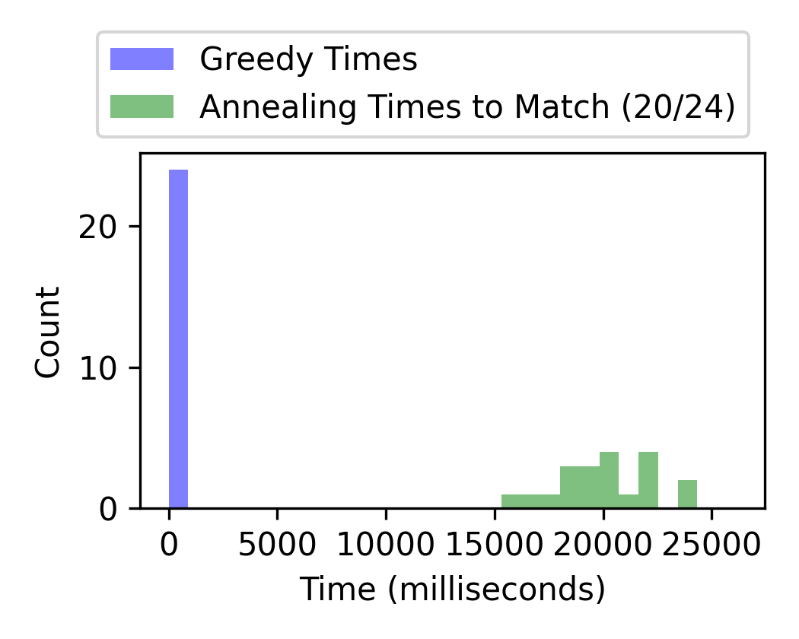
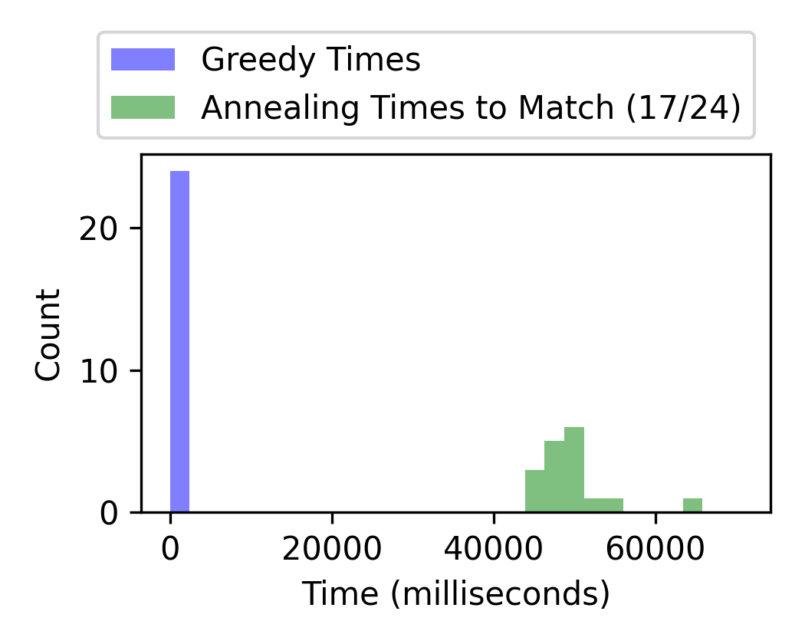

Telescope Scheduling via Simulated Annealing
============================================

**Note.**
These files are meant only to demonstrate personal coding capabilities
and style.  They are not intended for any other purpose or use.

Overview.
--------------------------------------------------

**Generic Problem.**
This code solves a kind of double-option version of the classic
traveling sales problem.  In this variation, the goal is still to
minimize the distance travelled, however now no destination is
fixed—instead, each is accessible from two distinct coordinate
configurations.  The problem is therefore not merely to order the
destinations well, but also to optimize the choice of which
configurations to use.

**The Specific Problem.**
This problem became of interest while using a small backyard
telescope.  Telescopes turn horizontally side to side as well as
vertically up and down, but some may be able to move vertically
*beyond straight upwards*.  If so, every direction in the sky can be
viewed using two telescope configurations, not just one.

**The Code.**
The entire program is run by the shell script `run.sh`, using input
specified in `run_details.csv`.  There are essentially three parts to
the program.

1. Two Python scripts set everything up.  First, the script
`pyth/prepare_details.py` reads `run_details.csv` and writes a
temporary file, `temp.sh`, which calls everything else in the program.
The telescope problems are then generated by `pyth/setup.py`, which
generates random problem instances of arbitrary size. Some of these
initial processing steps use [pandas](https://pandas.pydata.org/) and
[NumPy](https://numpy.org/), though not much.

2. C++ code then solves the problem two ways:

   (a) using a greedy algorithm (focused in `src/TelGreedy.h`), and

   (b) using a simulated annealing algorithm (in `src/TelAnnealer.h`,
   which derives from a virtual class useful for a generic simulated
   annealing problem, in `src/SimAnneal.h`).

   The annealing algorithm uses randomized reorderings and is very
   closely based on the traveling sales solution presented in the book
   *Finite Markov Chains and Algorithmic Applications* by O.
   Häggström.  The permutations to randomly reorder here are the same
   as used there, but the distinction here is we also allow swaps of
   the configurations.  Annealing controls are also specified within
   `run_details.csv`, which do need manual tuning for each problem.

3. Python scripts using [matplotlib](https://matplotlib.org/) to plot the telescope schedules
(`pyth/plot.py` and `pyth/animate.py`) and plot summary graphs
(`pyth/summary.py`).

Some sample schedules output are shown below.

| Greedy Solution | Annealing Solution |
| --------------- | ------------------ |
|  | 

| Greedy Solution | Annealing Solution |
| --------------- | ------------------ |
|  |  |

Interpret these pictures almost as if looking into the sky.  Each dot
is a desired direction.  The color—orange or blue—indicates which of
the two possible telescope orientations to use.  The sole green dot
is the starting location.

**Distances.** The polar angle position represents horizontal
telescope rotations and the radial distance represents a spherical
angle between the telescope and the vertical, straight-up direction.
(In mathematics, such spherical coordinates are traditionally denoted
by $\theta$ and $\phi$, respectively.)  Blue points have a positive
spherical angle, while orange points have a negative spherical angle.
The formula used to determine distance between two configurations
$(\theta_1, \phi_1)$ and $(\theta_2, \phi_2)$ is

$$ \max\left\{
    |\phi_1 - \phi_2|,
    \min\begin{pmatrix}
            |\theta_1 - \theta_2|, \\
            |\theta_1 - \theta_2 - 2\pi|, \\
            |\theta_1 - \theta_2 + 2\pi|
    \end{pmatrix}
    \right\}. $$

The triple-minimum assumes the telescope can rotate horizontally
beyond $2\pi$ without issue.  The maximum models a telescope that has
two separate hinges for $\theta$ and $\phi$ and can adjust each of
them independently at the same speed.

Comparison.
--------------------------------------------------

The plots below show roughly how well the annealing method compares to
the greedy solution on inputs of various sizes (the number of
direction requests, shown in the # column).  In the first column of
plots, each line indicates epoch-by-epoch improvement; the lines
change color from blue to green once (if) annealing beats the greedy
score. The second column of plots show histograms of the score
*improvements* if we use annealing rather than the greedy approach;
again, in the green region, annealing led to an improvement, while
in the blue region, greedy was better throughout. In these first two
columns of charts, a parenthetical like "Greedy (6/20)" in the legend
indicates that in 6 out of 20 runs, the greedy algorithm was better.

The last column shows how long (in nanoseconds) the greedy algorithm
needed to run.  In green it shows how long before the annealing
algorithm managed to *match* the greedy score.  In these, legend
entries like "Annealing (17/20)" indicate that only 17 annealing
rounds beat the corresponding greedy score, and so the green histogram
bars only add up to 17.

| # | Distance By Epoch | Score Comparison | Time Until Annealing Matches |
|---|--------------------|--------------|---------------|
20 |  |  | 
50 |  |  | 
100 |  |  | 

References.
--------------------------------------------------

- Olle Häggström,
  *Finite Markov Chains and Algorithmic Applications*,
  Cambridge University Press, Cambridge, 2002.

- J. D. Hunter,
  *Matplotlib: A 2D graphics environment*,
  Computing in Science & Engineering **9** (2007), no. 3, 90–95.

Links to Python packages:
- [matplotlib](https://matplotlib.org/). See https://matplotlib.org/
- [NumPy](https://numpy.org/). See https://numpy.org/
- [pandas](https://pandas.pydata.org/). See https://pandas.pydata.org/
