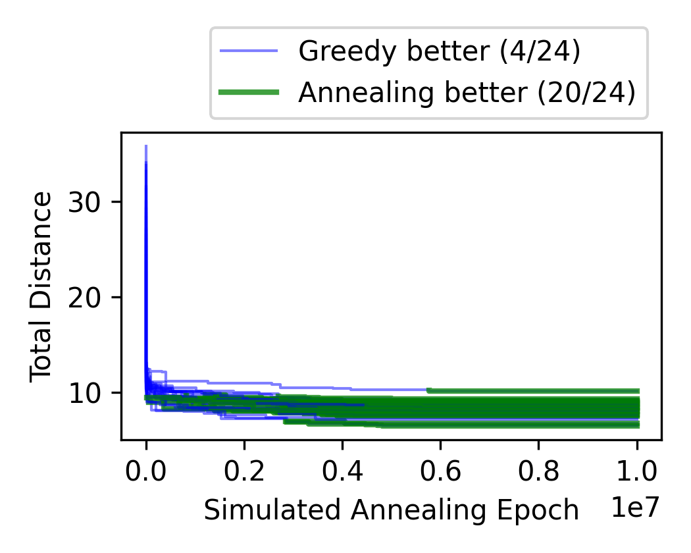
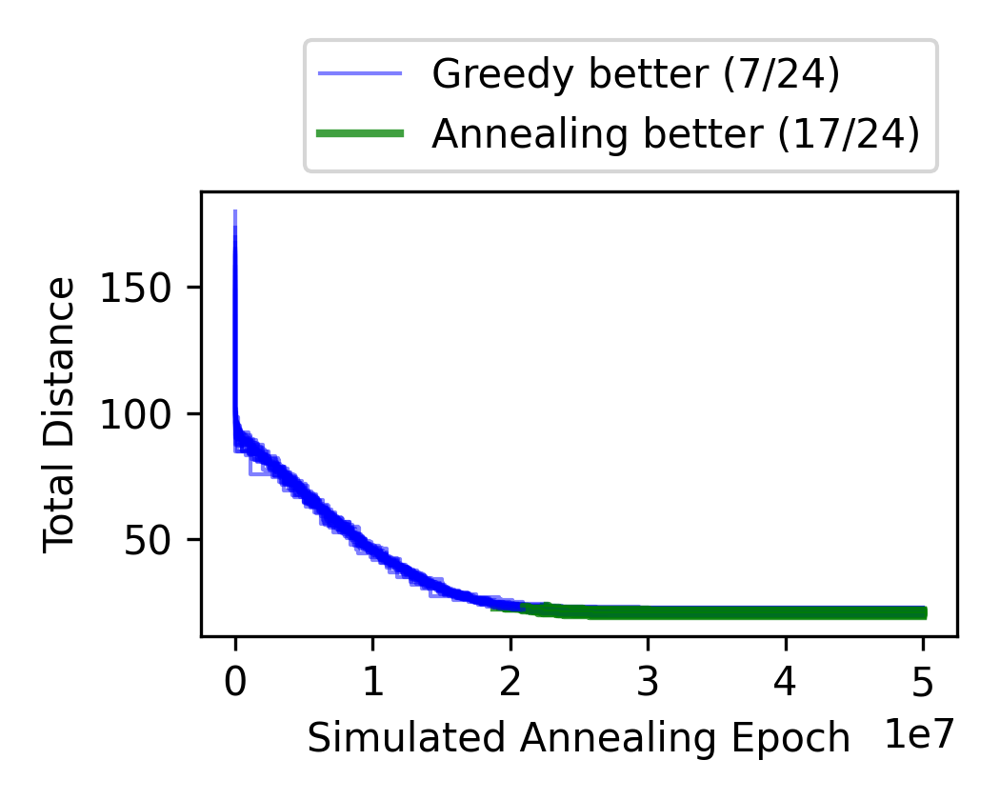
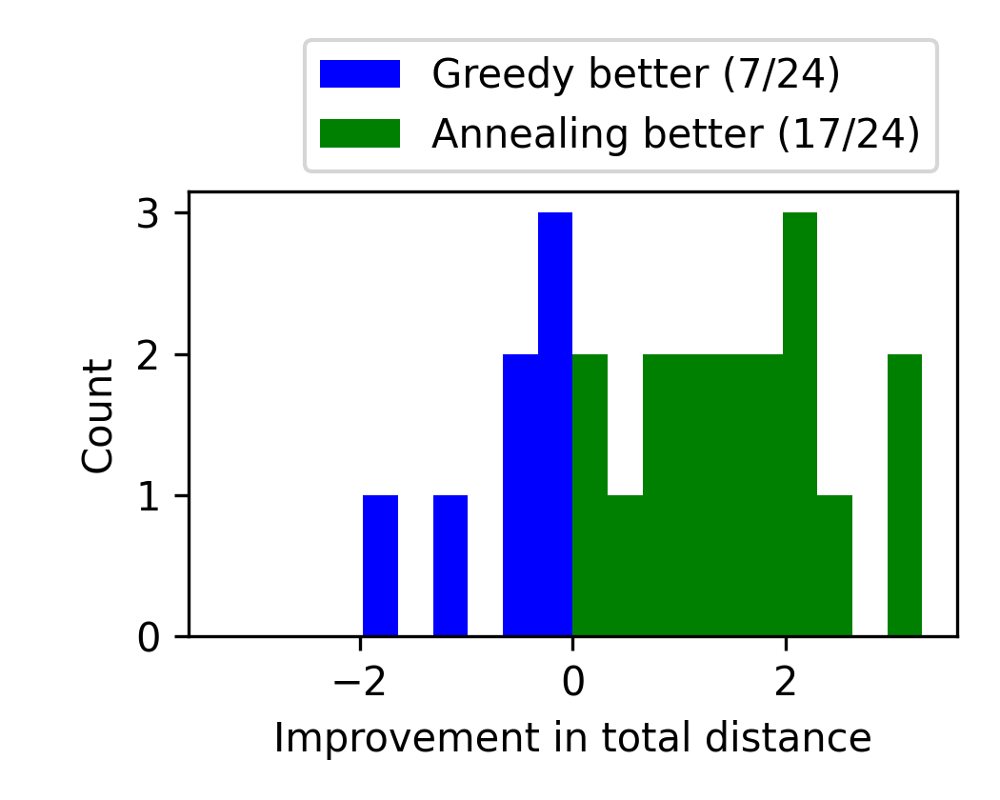

Telescope Scheduling via Simulated Annealing
============================================

**Note.**
These files are meant only to be browsed by humans for a demonstration
of my personal coding capabilities and style.  They are not for any
other purpose or use.

Overview.
--------------------------------------------------

**Generic Problem.**
This code solves a kind of double-option version of the classic
traveling sales problem.  In this variation, the goal is still to
minimize the distance travelled, however now, no destination is
fixed.  Instead, each destination is accessible from two distinct
coordinate locations.  The problem, therefore, is not merely ordering
the destinations well, but also optimizing choices about which
locations to use.

**The Specific Problem.**
This problem became of interest while using a small backyard
telescope.  Telescopes turn horizontally side to side as well as
vertically up and down, but some may be able to move vertically
*beyond straight upwards*.  For such a telescope, every direction in
the sky can be viewed using either of two distinct telescope
configurations.  The problem above is then useful:  if we want to view
many directions in the sky, in what order should we view them,
and which configuration should we use for each direction?

**The Code.**
The entire program is run by the shell script `run.sh` using input
specified in `run_details.csv`.  The program essentially has three
parts.

1.  *Setup in Python.* \
    First, the script `pyth/prepare_details.py` reads `run_details.csv`
    and writes a temporary script, `temp.sh`.  This temporary script
    calls everything else in the program.

    Random telescope routing problems are built within
    `pyth/setup.py`—specifically the `simulate_locs(…)` method.  These
    random problems are stored within the `input/` directory.  Each
    input file lists a specified number of directions in the sky—the
    directions that the telescope must somehow visit—which are randomly
    and uniformly chosen. For reproducibility, each such input problem
    is labeled with a distinct `run id` that corresponds to the random
    seed used.

    Some of these initial processing steps use
    [pandas](https://pandas.pydata.org/) to unpackage the CSV file and
    [NumPy](https://numpy.org/) to generate and save the many
    directions together (as well as later, in part 3, to help build the
    histogram bins).

2.  *Optimization in C++.* \
    There is C++ code that runs two different optimization algorithms:

    (a) a greedy algorithm (focused in `src/TelGreedy.h`), and \
    (b) a simulated annealing algorithm (in `src/TelAnnealer.h`,
    deriving from a virtual class useful for more general simulated
    annealing problems, in `src/SimAnneal.h`).

    Briefly, simulated annealing is an optimization technique where a
    random process runs so that it favors better answers over time.
    For this telescope problem, the random process continues to alter
    a schedule.  The alterations here are almost exactly like those
    reorderings presented in O. Häggström's book *Finite Markov Chains
    and Algorithmic Applications*, which discusses how to apply
    simulated annealing to the ordinary traveling sales problem.  The
    only distinction between the permutations used in that book and
    those used here is that here we also allow swaps between the two
    possible telescope configurations. The annealing method does
    require some manual tuning; these controls are specified in
    `run_details.csv`.

3.  *Plotting in Python.* \
    Finally, the program uses [matplotlib](https://matplotlib.org/) to
    plot static and animated telescope schedules (see `pyth/plot.py`
    and `pyth/animate.py`) in addition to several summary graphs
    (`pyth/summary.py`).

Below are some sample schedules ouput by the program from each method.
For the latter example, there is also an animation showing
iterative improvements from annealing.

| Greedy Answer | Annealing Answer |
| --------------- | ------------------ |
|  | 

| Greedy Answer | Annealing Answer |
| --------------- | ------------------ |
|  |  |

Interpret these pictures almost as if looking into the sky.  Each dot
is a desired direction in the sky, and the connecting lines show a
route. A direction's polar angle (*i.e.,* traveling counterclockwise)
measures the telescope's horizontal rotation.  The distance from the
center represents a distance to the vertical as the telescope moves up
and down.  The telescope's configuration is naturally represented by a
spherical coordinate system, traditionally denoted in mathematics by a
pair $(\theta, \phi)$ with $0 \le \theta < 2\pi$ and $-\pi/2 \le \phi
\le \pi/2$; this is the notation used below.

The color for each direction—orange or blue—indicates which of the two
possible telescope orientations to use. Blue points have a positive
spherical angle ($\phi > 0$), while orange points have a negative
spherical angle ($\phi < 0$). The sole green dot is the starting
direction; it is assumed throughout that the starting direction and
configuration are fixed (in the input, the direction with `id=0`).

**Distances.**
The formula used to determine distance between two telescope
configurations $(\theta_1, \phi_1)$ and $(\theta_2, \phi_2)$ is

$$ \max \left[
    |\phi_1 - \phi_2|,
    \min\begin{pmatrix}
            |\theta_1 - \theta_2|, \\
            |\theta_1 - \theta_2 - 2\pi|, \\
            |\theta_1 - \theta_2 + 2\pi|
    \end{pmatrix}
    \right] . $$

The triple-minimum assumes the telescope can rotate horizontally
through multiples of $2\pi$ without issue.  The maximum models a
telescope with two separate hinges—one changing $\theta$ and changing
$\phi$—that can be adjusted independently at the same time, and at the
same rate.

Comparison.
--------------------------------------------------

The plots below show roughly how well the annealing method compares to
the greedy solution on inputs of various sizes.  The input size, or
the number of direction requests, is shown in the # column.

In the first column of plots, each line indicates the annealing's
epoch-by-epoch improvement; the lines change color from blue to green
when (if) annealing manages to match the greedy score.  The second
column of plots show histograms of the score *improvements* if we use
annealing rather than the greedy approach; again, in the green region,
annealing led to an improvement, while in the blue region, greedy was
better throughout.  In these first two columns of charts, a
parenthetical like "Greedy (6/20)" in the legend indicates that in 6
out of 20 runs, the greedy algorithm was better.

The last column shows blue histograms of how much time the greedy
algorithm required.  In green it shows how long before the annealing
algorithm managed to *match* the greedy score (rather than the total
time until the specified number of epochs finished).  In these, legend
entries like "Annealing (17/20)" indicate that only 17 rounds did
match the corresponding greedy score, and so the green histogram bars
only add up to 17.

| # | Distance By Epoch | Score Comparison | Time Until Annealing Matches |
|---|--------------------|--------------|---------------|
20 |  |  | 
50 |  |  | 
100 |  |  | 

References.
--------------------------------------------------

- Olle Häggström,
  *Finite Markov Chains and Algorithmic Applications*,
  Cambridge University Press, Cambridge, 2002.

- J. D. Hunter,
  *Matplotlib: A 2D graphics environment*,
  Computing in Science & Engineering **9** (2007), no. 3, 90–95.

As mentioned above, the Python scripts used several well-known
plotting and data packages.  Links to these packages' websites are
below:
- [matplotlib](https://matplotlib.org/). See https://matplotlib.org/
- [NumPy](https://numpy.org/). See https://numpy.org/
- [pandas](https://pandas.pydata.org/). See https://pandas.pydata.org/
